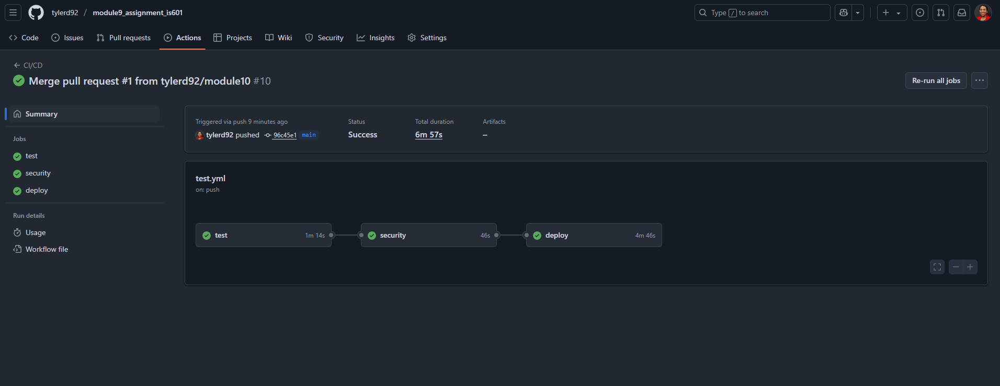
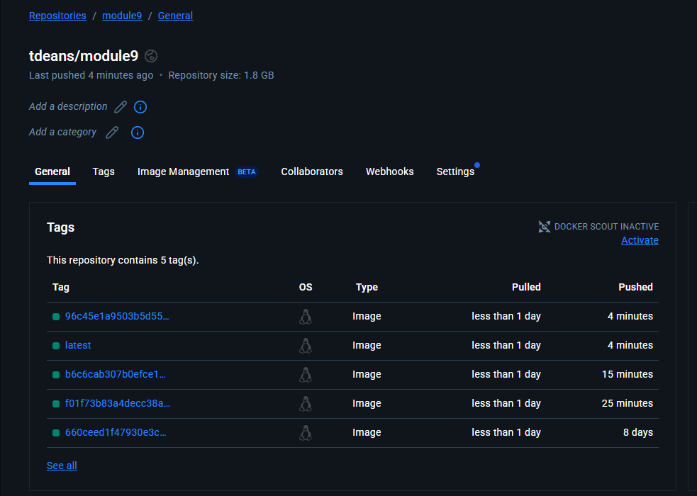

## Module 9 Assignment
### Also includes Module 10 and Module 11 code.


[Docker Hub Link ](https://hub.docker.com/repository/docker/tdeans/module9/general)

Testing Commands
```
pytest # to run all tests
pytest -s -v # for more verbose output
pytest --preserve-db # to preserve the database between tests
pytest --run-slow # to run slow tests
```
GitHub Action Run


Updated Docker Repository



Create Tables


Insert Data


Select from Calculations Table


Select from Users Table


Query Joined Tables


Update a Record


Delete a Record


